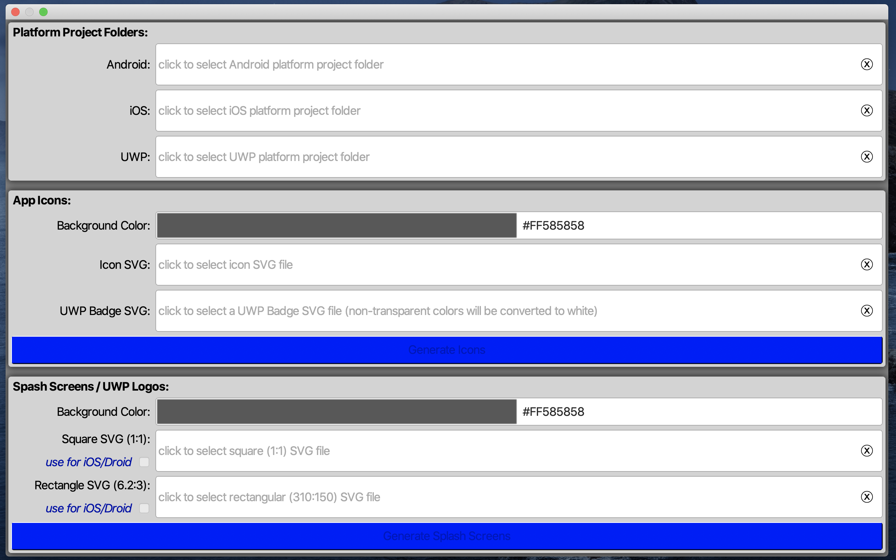
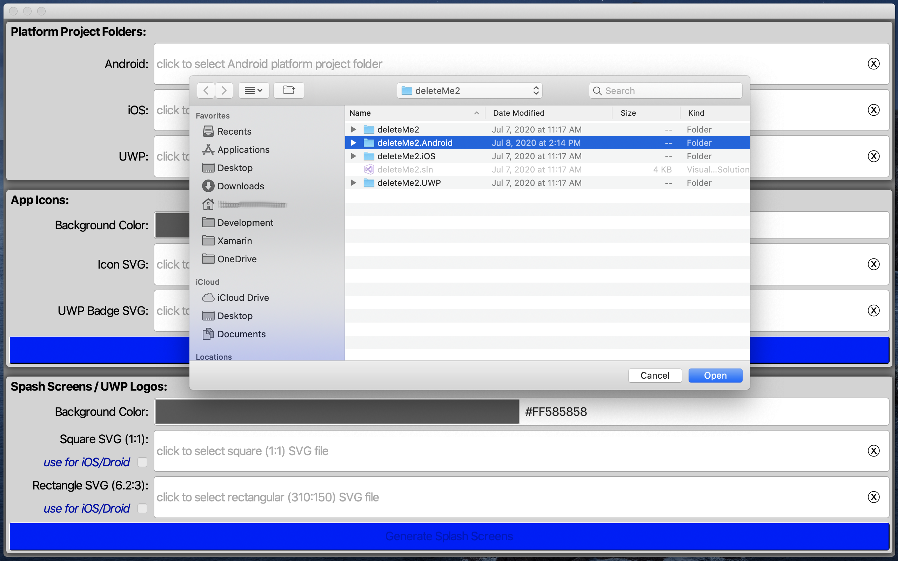
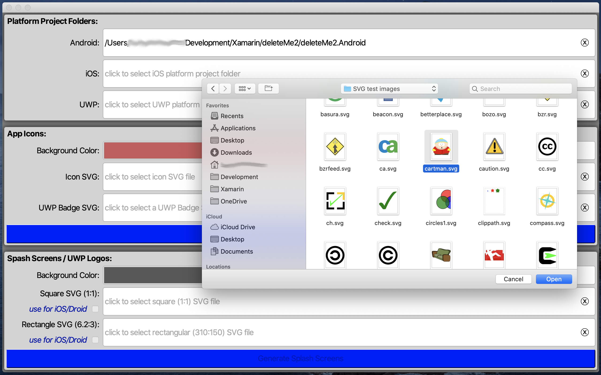
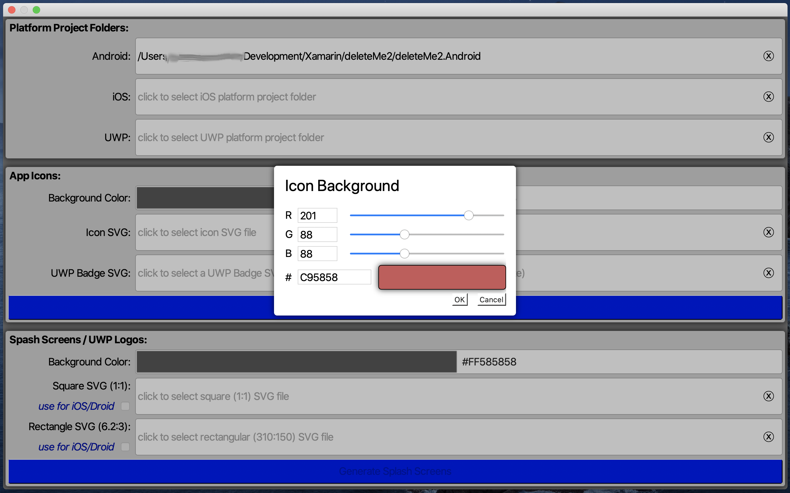
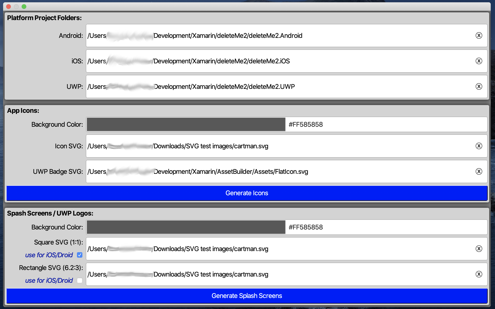

# AssetBuilder

A tool to automate the process of creating Xamarin.Forms icons and splash screens from SVGs.

If you've come here, it is likely you've at least once spent a good part of a day generating all of the icon images and splash screen images for a Xamarin project.  More than once I've tweaked a script to do this and still felt the process could have been easier and faster.  

The **Visual Assets** tab of the **AppXManifest** editor of **VisualStudio 2019** is easier and faster.  It's nice having an tool to generate all of your icons and splash images from one (or two) files. But it only works for UWP apps.

And then, for me, the straw that broke the camel's back was the introduction of vector icons and splash images for Android. With Android API 26, the rendering quality of icons and splash images improved dramatically - but it also became nearly impossible to do this in a script.  

And thus, once I had some free time, I started working on this project.

## Usage

After launching **AssetBuilder**, start by selecting the **Xamarin.Forms** platform project folders for which you wish to generate icons and splash screens.  If you tap on the **Android** field in **Platform Project Folders**, you will get a folder picker dialog:

Note that **AssetBuilder** will inspect the `.csproj` file in the folder you choose to verify it is a Xamarin platform project for the type of platform (Android, iOS, UWP) choosen.  If it isn't, it will present to you an alert describing what it couldn't verify.

Also, you don't have to pick all three platforms.  If you only want to generate assets for your Android project, then just pick the Android project folder.

Once you have choosen the folder(s) for the platform project(s) for which you want to generate assets, next, choose the SVG files for the assets (icons and/or splash screens) you want to generate.  In this example, we'll tap on the **Icon SVG** field in the **App Icons** section to get a file picker.

In the above screen shot, the file picker layout was changed to an icon view in order to be able to see thumbnails of each SVG.

Like the project folders, you don't have to pick SVG files for both types of icons and splash screens.  If you just want to generate icons, you can leave the other SVGs fields empty and it won't generate them.

You can also click on the color swaths to edit the **Background Color** for the **App Icons** and the **Splash Screens / UWP Logos**.  

If you have both a square and a rectangular splash screen SVG, you can use the ***use for iOS/Droid*** check box to choose which of those SVG files will be used to generate the iOS and Android splash screen images.

Once a minimal combination of platform project folders and SVG files has been choosen, the **[Generate Icons]** and/or **[Generate Splash Screens]** buttons will be enabled.

## What happens under the covers

When you tap on either **Generate** button, **AssetBuilder** will perform a series of transformations.  The first is to convert your image from SVG to AndroidVector format.  This is because AndroidVector (in this context) is the lowest common denominator format for all of the assets.  This is meant to assure that all generated assets will appear identical.  

**NOTE**: AndroidVector is little limited in what it can and cannot do.  For example, text and radial gradients with different start and end center points are not supported.  If you're like me, it is likely, at some point in time, you are going to want text in a generated asset.  To do that, I suggest you use a vector editor (like [Inkscape]( https://inkscape.org)) and [convert the text to paths](https://www.youtube.com/watch?v=_01Jdvr7eXI).

### Icons

After the SVG image has been transformed to an AndroidVector image,  the next step is generating the icon files.  For UWP and iOS, this means applying the selected background color and then iterating through the required sizes of .pngs.  For Android, in addition to iterating through the required sizes of .pngs, it also creates or updates the appropriate Android Vector XML files to support Android API 26+ rectangular and circular icons.  

Lastly, the platform project's .csproj (and UWP's .appxmanifest) files are updated so the new assets are known to VisualStudio.

### Splash screens

A bit more is going on with Splash Screens.  As before, the first step is to convert the choosen SVG(s) to AndroidVector.  Next the UWP splash images are generated and the UWP project's `.appxmanifest` file is updated to set the background color and point to the various renditions.

For Android, both vector (to support API 26+) and raster splash images, derived from the choosen splash SVG, are saved to the Android project's **Resources** folder.  Additionally, a `SplashActivity.cs` file is added to the Android project (to provide a splash screen) and the Android project's `MainActivity.cs` file is updated to relinquish the **`MainLauncher`** attribute.  Next, the Android project's `.csproj` file is updated.

Lastly, for iOS, the choosen splash image is converted to a PDF and it is saved to a **Splash.ImageSet** folder that is in turn added to the iOS project's **Assets.xcassets** folder.  Then the project's **LaunchScreen.storyboard** is modified to point to this new PDF and to set the splash screen's background color.  Lastly, the iOS project's `.csproj` file is updated to reflect these changes.

## Building

**AssetBuilder** has an MIT OpenSource license, so feel free to build it yourself.  But first please take about 5 seconds and think about how valuable your time is.  If you do, I'm guessing you will quickly realize it's a whole lot smarter to just pay me to build it for you, giving Microsoft and Apple their share to verify that it's not malicious.  You can get the [UWP version in the Microsoft App Store](https://www.microsoft.com/en-us/p/asset-generator-for-xamarin/9ntjz6rr4xcp?rtc=1&activetab=pivot:overviewtab) (one month free trial).  I'll post a link to the Mac App Store version once I finally get past [a crazy provisioning problem that has stumpted me](https://github.com/xamarin/xamarin-macios/issues/9076).
